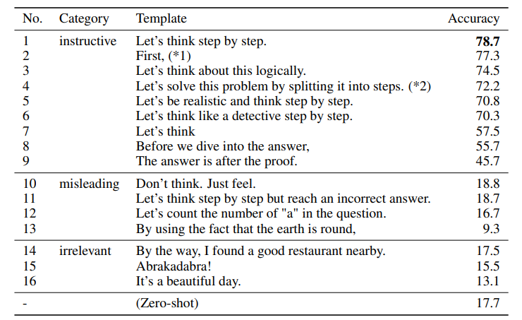
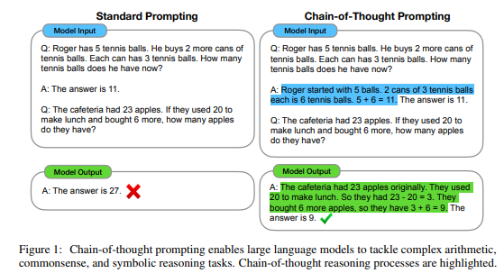

## Prompt Engineering

  Welcome to the wonderful world of prompt engineering! Getting the best content out of your language models all starts with crafting the perfect prompt. Even something as simple as saying "[Let's think step by step](https://arxiv.org/pdf/2205.11916.pdf)" can drastically increase performance. 
  

Chain of thought prompting and using 'few-shot learning', or having examples of other inputs with desired outcomes in the prompt, are two other very powerful prompting techniques. 

Prompt engineering is the secret sauce to getting the most out of language models like GPT-3. One way to think about it is to try and pass in text that most likely would come before the output you are looking for. 

Let's say you want to use GPT-3 to write a story. By giving the model a prompt that includes the genre, characters, and setting, you can help it create a story that fits your vision. You can even use a new tool called [Langchain](https://github.com/hwchase17/langchain) to chain together actions into a multi step prompt. 

Prompt engineering can be used for a wide variety of tasks, from translation to question answering. With the right prompt, you can make GPT-3 work for you in ways you never thought possible. [Researchers showed](https://arxiv.org/pdf/2301.13294.pdf) that prompt engineering can be so powerful that by putting examples of accurate translations in a prompt, the translation capabilities of GPT3 outperform Google Translate, a model finetuned specifically for that purpose!

And the best part? Anyone can do it! With a little bit of creativity and some trial and error, you can create the perfect prompt to get the results you want. It's almost like crafting magic spells.

## Additional Prompt Engineering Resources

- [Dair-AI Prompt Engineering Guide](https://github.com/dair-ai/Prompt-Engineering-Guide)
- [OpenAI Cookbook](https://github.com/openai/openai-cookbook)
- ['Advanced ChatGPT Prompt Engineering'](https://jamesbachini.com/advanced-chatgpt-prompt-engineering/)
- [How To Use ChatGPT to Boost Your Writing](https://oneusefulthing.substack.com/p/how-to-use-chatgpt-to-boost-your)